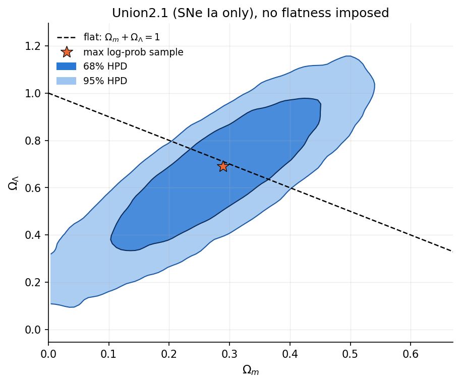
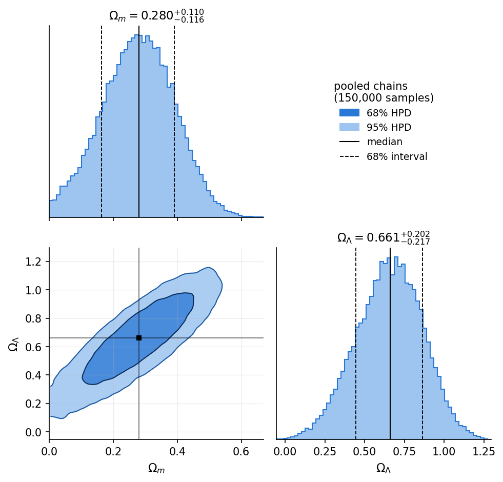

# Numerical_Cosmology

Constraints on the matter and dark-energy densities `(Ωm, ΩΛ)` from the Union2.1
Type Ia supernova compilation, **without imposing flatness**, using a from-scratch
Metropolis–Hastings sampler and a full set of convergence diagnostics.

The project is a small, tested Python library (`cosmo_library`) plus one
reproducible notebook that runs the whole analysis. It implements the exercise
proposed in the lecture *Sampling Methods: Markov chain Monte Carlo and the
Metropolis–Hastings algorithm* (slides 32–35; the slides themselves are not
included in this repository).

| 68% / 95% HPD contours | Corner plot |
|---|---|
|  |  |

## Contents

1. [Getting the code](#getting-the-code)
2. [Installation](#installation)
3. [Running the tests](#running-the-tests)
4. [Running the analysis](#running-the-analysis)
5. [Repository layout](#repository-layout)
6. [Where the sampling settings live](#where-the-sampling-settings-live)
7. [Using the library](#using-the-library)
8. [Assumptions](#assumptions)
9. [Convergence diagnostics](#convergence-diagnostics)
10. [Results](#results)
11. [What the tests cover](#what-the-tests-cover)
12. [References and license](#references-and-license)

## Getting the code

```bash
git clone https://github.com/VictorRoberto132/Numerical_Cosmology.git
cd Numerical_Cosmology
```

The two Union2.1 data files are small text files and are versioned in
`union_data/` (about 6 MB), so nothing else has to be downloaded.

## Installation

Python ≥ 3.9. Create an isolated environment first (either one works):

```bash
python -m venv .venv && source .venv/bin/activate     # venv
# or
conda create -n numcosmo python=3.11 && conda activate numcosmo
```

Then install the library in editable mode. The extras add what the tests and the
notebook need:

```bash
pip install -e ".[dev,notebook]"
```

| Extra | Installs | Needed for |
|---|---|---|
| *(none)* | `numpy`, `scipy` | using `cosmo_library` |
| `dev` | `pytest` | running the tests |
| `notebook` | `matplotlib`, `jupyter`, `ipympl` | running `union21_analysis.ipynb` |

## Running the tests

From the repository root:

```bash
pytest
```

The suite runs in a few seconds. The data-dependent tests look for the Union2.1
files in `union_data/`; to point them elsewhere set `UNION_DATA_DIR`. If the
files are not found those tests are skipped, not failed.

## Running the analysis

The whole analysis is `notebooks/union21_analysis.ipynb`. Open it with Jupyter
and use *Restart & Run All*:

```bash
jupyter lab notebooks/union21_analysis.ipynb
```

or run it headless, overwriting the stored outputs:

```bash
jupyter nbconvert --to notebook --execute --inplace notebooks/union21_analysis.ipynb
```

It takes about a minute. All random seeds are explicit, so a re-run reproduces
the same chains and numbers. The last cell writes the figures to
`notebooks/figures/`:

| File | What it shows |
|---|---|
| `burnin.png` | discarded burn-in of every chain, from dispersed starts |
| `traces.png` | retained traces and acceptance rate per chain |
| `acf.png` | autocorrelation functions |
| `dunkley_spectra.png` | Dunkley power-spectrum fit for every chain and parameter |
| `contours.png` | 68% / 95% HPD contours in `(Ωm, ΩΛ)` |
| `corner.png` | corner plot with medians and 68% intervals |

The notebook uses the `%matplotlib widget` backend, which is why `ipympl` is in
the `notebook` extra.

## Repository layout

```
Numerical_Cosmology/
├── cosmo_library/            the installable package
│   ├── cosmology.py          FLRW background: E, H, ages, distances, mu, dV/dz/dΩ
│   ├── data.py               Union2.1 loader and marginalized-M likelihood
│   ├── likelihood.py         Union2.1 posterior in (Ωm, ΩΛ) with a box prior
│   ├── bayes.py              Posterior, proposals, Metropolis–Hastings, tuning helpers
│   ├── diagnostics.py        acceptance, ACF/ESS/MCSE, R-hat variants, Dunkley test
│   └── postprocess.py        credible intervals and HPD contour levels
├── tests/                    pytest suite (one file per module)
├── notebooks/
│   ├── union21_analysis.ipynb   the reproducible analysis
│   └── figures/                 figures written by the notebook
├── union_data/               Union2.1 supernova table and systematics covariance
├── pyproject.toml            package metadata, dependencies, pytest configuration
├── LICENSE                   MIT
└── README.md
```

## Where the sampling settings live

The sampler `MetropolisHastings.sample(initial_state, n_steps, rng)` only runs
the number of steps it is asked for; it has no notion of warm-up or burn-in. All
the settings are constants at the top of two cells of the notebook:

| Setting | Constant | Default | Notebook section |
|---|---|---|---|
| tuning chain length | `N_WARMUP` | 8000 | 3 |
| samples dropped from each tuning chain | `N_DISCARD_TUNE` | 1000 | 3 |
| tuning rounds | `N_TUNE_ROUNDS` | 2 | 3 |
| number of chains | `N_CHAINS` | 5 | 4 |
| burn-in per chain (discarded) | `N_BURN` | 3000 | 4 |
| retained steps per chain | `N_STEPS` | 30000 | 4 |
| seeds | `SEED_WARMUP`, `SEED_STARTS`, `SEEDS` | 7, 2024, 101–105 | 3, 4 |

If you raise `N_CHAINS`, extend `SEEDS` (and `CHAIN_COLORS` in section 1) to match.

The order of events is:

1. **Warm-up (section 3).** Short chains starting from a hand-picked diagonal
   proposal estimate the posterior covariance. After each round the proposal
   covariance is set to `(2.4²/d)·Σ̂`, where `Σ̂` is the sample covariance of the
   round (`scaled_proposal_cov`, regularized so it can be Cholesky-factorized).
   None of the warm-up samples is reused.
2. **Freeze.** The final covariance becomes `PROPOSAL_COV` and is never adapted
   again. `GaussianRandomWalk` computes its Cholesky factor `L` from it.
3. **Burn-in (section 4).** `N_CHAINS` chains start from well-separated valid
   points (`dispersed_starts`). Each runs `N_BURN + N_STEPS` steps and the first
   `N_BURN` are dropped; the notebook plots them to justify the choice.
4. **Retained sampling.** The remaining `N_STEPS` steps per chain are kept
   **unthinned**, with rejected steps repeating the current state. Everything
   from section 5 onward uses only these samples.

## Using the library

A short end-to-end run (smaller than the notebook; about 10 s):

```python
import numpy as np

from cosmo_library.data import Union21
from cosmo_library.likelihood import make_union21_posterior
from cosmo_library.bayes import (
    GaussianRandomWalk, MetropolisHastings, scaled_proposal_cov, dispersed_starts,
)
from cosmo_library import diagnostics as dg
from cosmo_library.postprocess import credible_interval

BOUNDS = ((0.0, 2.0), (-1.0, 3.0))
data = Union21("union_data")                                   # 580 SNe + covariance
posterior = make_union21_posterior(data, H0=70.0, bounds=BOUNDS)

# 1) warm-up: tune the proposal covariance, then freeze it
cov, x = np.diag([0.05**2, 0.10**2]), np.array([0.3, 0.7])
for k in range(2):
    run = MetropolisHastings(posterior, GaussianRandomWalk(cov)).sample(
        x, 4000, rng=np.random.default_rng(7 + k))
    cov = scaled_proposal_cov(run.samples[500:])
    x = run.samples[-1]

# 2) dispersed chains; drop the burn-in, keep the rest unthinned
n_burn, n_steps, n_chains = 1000, 5000, 4
starts = dispersed_starts(posterior, BOUNDS, n_chains, rng=np.random.default_rng(2024))
sampler = MetropolisHastings(posterior, GaussianRandomWalk(cov))
runs = [sampler.sample(x0, n_burn + n_steps, rng=np.random.default_rng(seed))
        for x0, seed in zip(starts, range(101, 101 + n_chains))]
chains = np.stack([r.samples[n_burn:] for r in runs])          # (n_chains, n_steps, 2)

# 3) diagnostics and constraints
for row in dg.summary(chains, ["Omega_m", "Omega_Lambda"]):
    print(f"{row['name']:<13} Rhat={row['split_rhat']:.3f}  bulk-ESS={row['ess_bulk']:.0f}  "
          f"tail-ESS={row['ess_tail']:.0f}")
med, lo, hi = credible_interval(chains[:, :, 0].ravel(), 0.68)
print(f"Omega_m = {med:.3f} +{hi - med:.3f} -{med - lo:.3f}")
```

Because the sampler only talks to a `Posterior` and a `Proposal`, the same code
samples any target. For example, a toy Gaussian:

```python
from cosmo_library.bayes import Posterior
post = Posterior(lambda th: -0.5 * th @ th, lambda th: 0.0)   # N(0, I), flat prior
```

### Main interfaces

| Module | Interface |
|---|---|
| `cosmology` | `FLRW(H0, omega_m, omega_lambda, omega_r=0)` with `E`, `H`, `age`, `lookback_time`, `conformal_time`, `comoving_distance` (χ), `comoving_transverse_distance` (D_M), `angular_diameter_distance`, `luminosity_distance`, `distance_modulus`, `comoving_volume_element`. Distances in Mpc, times in Gyr; NaN where `E²(z) ≤ 0`. |
| `data` | `Union21(data_dir)` with `.z`, `.mu`, `.cov`, `.n`, `.log_likelihood(mu_theory)`, `.best_fit_M(mu_theory)` |
| `bayes` | `Posterior(log_likelihood, log_prior, model=None)`; `Proposal.propose` / `.logpdf`; `GaussianRandomWalk(cov)`; `MetropolisHastings(posterior, proposal).sample(x0, n_steps, rng)` → `SamplingResult(samples, log_probs, accepted, acceptance_rate)`; `scaled_proposal_cov`; `dispersed_starts` |
| `diagnostics` | `acceptance_rate`, `autocorr`, `integrated_time`, `ess`, `ess_bulk`, `ess_tail`, `ess_quantile`, `mcse`, `split_rhat`, `rank_normalized_rhat`, `folded_rank_normalized_rhat`, `power_spectrum`, `dunkley_test`, `summary` |
| `postprocess` | `credible_interval`, `contour_levels_2d` |

## Assumptions

* **Parameters and prior.** `(Ωm, ΩΛ)` with a uniform box prior
  `0 ≤ Ωm ≤ 2`, `−1 ≤ ΩΛ ≤ 3`. Flatness is **not** imposed:
  `Ωk = 1 − Ωm − ΩΛ` is derived for every sample.
* **The zero point `M` is integrated out analytically**, with a flat (improper)
  prior. `M` enters the model additively, `μ_th = μ_shape(z; Ωm, ΩΛ) + M`, so
  the Gaussian `χ²` is quadratic in `M`: `χ²(M) = A − 2BM + EM²`, with
  `A = ΔμᵀC⁻¹Δμ`, `B = 1ᵀC⁻¹Δμ`, `E = 1ᵀC⁻¹1`. Completing the square gives
  `log L = −½ (A − B²/E)` up to a constant. The result is invariant to a global
  shift of `μ`, which is tested.
* **`H0` is fixed at 70 km/s/Mpc.** It is degenerate with `M`, so the constraints
  do not depend on this value.
* **Covariance.** The `_sys` matrix (statistical + systematic) is used. Its
  diagonal already contains the statistical variances, so they are not added
  again. All products with `C⁻¹` are Cholesky solves; `C⁻¹` is never formed.
* **Data selection.** Only the 580 SNe that pass the release cuts are used.
* **Invalid models.** Points outside the prior, or with `E²(z) ≤ 0` or
  non-finite distances, have `log π = −∞` and are rejected.
* **Sampler.** Random-walk Metropolis–Hastings in log-probability. The current
  log density is cached, rejected steps repeat the current state, and the
  proposal covariance is frozen before any sample is retained.

## Convergence diagnostics

Computed on the unthinned, post-burn-in chains, for both parameters:

* trace plots and acceptance rate (reference: about 0.35 for `d = 2`);
* split, rank-normalized and folded `R̂` (guideline `< 1.01`);
* integrated autocorrelation time, ESS (plain, bulk and tail) and MCSE;
* the Dunkley power-spectrum test for every chain (`j⋆ > 20` and `r < 0.01`).

These thresholds are guidelines, not proofs: no single number establishes
convergence, and the Dunkley test does not detect a chain trapped in one mode.

## Results

Default settings, `Ωk` derived per sample, medians with equal-tailed 68% intervals
from the 5 pooled chains (150 000 samples):

| Parameter | Median | 68% interval |
|---|---|---|
| `Ωm` | 0.280 (+0.110 / −0.116) | [0.164, 0.391] |
| `ΩΛ` | 0.661 (+0.202 / −0.217) | [0.444, 0.863] |
| `Ωk = 1 − Ωm − ΩΛ` | 0.058 (+0.324 / −0.300) | [−0.242, 0.382] |

`P(Ωk < 0) = 0.43`, `P(Ωk > 0) = 0.57`: SNe alone do not distinguish a closed from
an open universe. Convergence: `R̂ ≤ 1.0003` in all three variants, total ESS of
about 20 600 per parameter (MCSE of the mean about 8·10⁻⁴ for `Ωm`), and the
Dunkley test passes for every chain and parameter.

## What the tests cover

| File | Checks |
|---|---|
| `test_cosmology.py` | `E(0) = 1`, low-z Hubble law, `D_M = χ` when flat, `D_L = (1+z)² D_A`, NaN for invalid `E²`, curvature branches, and `H`, ages, conformal time and volume element against Einstein–de Sitter closed forms |
| `test_bayes.py` | recovery of a known Gaussian target, reproducibility from a seed, rejected states repeated, invalid start rejected, out-of-prior proposals rejected |
| `test_data.py` | 580 SNe, data and covariance dimensions, covariance is symmetric positive-definite, shift invariance of the marginalized likelihood, invalid model gives `−inf` |
| `test_diagnostics.py` | ACF, `τ_int`, ESS, MCSE, R̂ variants and the Dunkley test against white noise and AR(1) processes with known answers |
| `test_postprocess.py` | credible intervals, HPD contour levels, proposal-covariance tuning and regularization, dispersed starts |

## References and license

* Union2.1 compilation: Suzuki et al. (2012), Supernova Cosmology Project.
* Analytic marginalization of a linear nuisance parameter: Amanullah et al.
  (2010), Appendix C.
* Power-spectrum convergence test: Dunkley et al. (2005).
* Rank-normalized, folded `R̂` and bulk / tail ESS: Vehtari et al. (2021).

Released under the MIT License; see [`LICENSE`](LICENSE).
